# Remote Assignment
#### By Pablo &copy; 

## PART 1 - DATABASE CONECTION

Database selection: Google Cloud Platform (SQL & Google BigQuery)

Database set up process step by step:
1. Create a free account in [Google Cloud Platform](https://cloud.google.com/)
2. Create a [MySQL 8.0 database intance](https://cloud.google.com/sql/docs/mysql/create-instance) using the default settings (CPU, Memory...)
3. Go to the recently created MySQL instance
4. Allow permissions API for [Cloud SQL](https://cloud.google.com/sql/docs/mysql/admin-api), [Cloud Shell Terminal](https://cloud.google.com/endpoints/docs/openapi/enable-api) and [BigQuery](https://cloud.google.com/bigquery/docs/enable-transfer-service)
5. Create database and tables schema using Cloud Shell Terminal:
    - Login to the MySQL instance
    ```
    gcloud sql connect <your-instance-ID> --user=root --quiet
    ```    
    - Create a database named Remote and access it
    ```
    create database Remote;
    use <database name>;
    ```
    - Create the tables using SQL
    ```
    create table factResellerSales(
        ProductKey INT,
        OrderDateKey INT,
        DueDateKey INT,
        ShipDateKey INT,
        ResellerKey INT,
        EmployeeKey INT,
        PromotionKey INT,
        CurrencyKey int,
        SalesTerritoryKey VARCHAR(255),
        SalesOrderNumber INT,
        SalesOrderLineNumber INT,
        RevisionNumber INT,
        OrderQuantity float,
        UnitPrice  float,
        ExtendedAmount INT,
        UnitPriceDiscountPct INT,
        DiscountAmount float,
        ProductStandardCost float,
        TotalProductCost float,
        SalesAmount float,
        TaxAmt float,
        Freight varchar(255),
        CarrierTrackingNumber varchar (255),
        CustomerPONumber TIMESTAMP,
        OrderDate TIMESTAMP,
        DueDate TIMESTAMP,
        ShipDate TIMESTAMP
    );
    create table DimCustomer(
        CustomerKey INT,
        GeographyKey INT,
        CustomerAlternateKey VARCHAR(255),
        Title VARCHAR(255),
        FirstName VARCHAR(255),
        MiddleName VARCHAR(255),
        LastName VARCHAR(255),
        NameStyle INT,
        BirthDate DATE,
        MaritalStatus VARCHAR(255),
        Suffix VARCHAR(255),
        Gender VARCHAR(255),
        EmailAddress VARCHAR(255),
        YearlyIncome INT,
        TotalChildren INT,
        NumberChildrenAtHome INT,
        EnglishEducation VARCHAR(255),
        SpanishEducation VARCHAR(255),
        FrenchEducation VARCHAR(255),
        EnglishOccupation VARCHAR(255),
        SpanishOccupation VARCHAR(255),
        FrenchOccupation VARCHAR(255),
        HouseOwnerFlag INT,
        NumberCarsOwned INT,
        AddressLine1 VARCHAR(255),
        AddressLine2 VARCHAR(255),
        Phone VARCHAR(255),
        DateFirstPurchase DATE,
        CommuteDistance VARCHAR(255)
    );
    create table DimProduct(
        ProductKey INT,
        ProductAlternateKey VARCHAR(255),
        ProductSubcategoryKey VARCHAR(255),
        WeightUnitMeasureCode VARCHAR(255),
        SizeUnitMeasureCode VARCHAR(255),
        ProductName VARCHAR(255),
        StandardCost VARCHAR(255),
        FinishedGoodsFlag INT,
        Color VARCHAR(255),
        SafetyStockLevel INT,
        ReorderPoint INT,
        ListPrice VARCHAR(255),
        Size VARCHAR(255),
        SizeRange VARCHAR(255),
        Weight VARCHAR(255),
        DaysToManufacture INT,
        ProductLine VARCHAR(255),
        DealerPrice VARCHAR(255),
        Class VARCHAR(255),
        Style VARCHAR(255),
        ModelName VARCHAR(255),
        StartDate VARCHAR(255),
        EndDate VARCHAR(255),
        Status VARCHAR(255)
    );

    create table DimSalesTerritory (
        SalesTerritoryKey INT,
        SalesTerritoryAlternateKey INT,
        SalesTerritoryRegion VARCHAR(255),
        SalesTerritoryCountry VARCHAR(255),
        SalesTerritoryGroup VARCHAR(255)

    );
    ``` 
    - Screenshot below references the above shell code (only includes factResellerSales creation)
    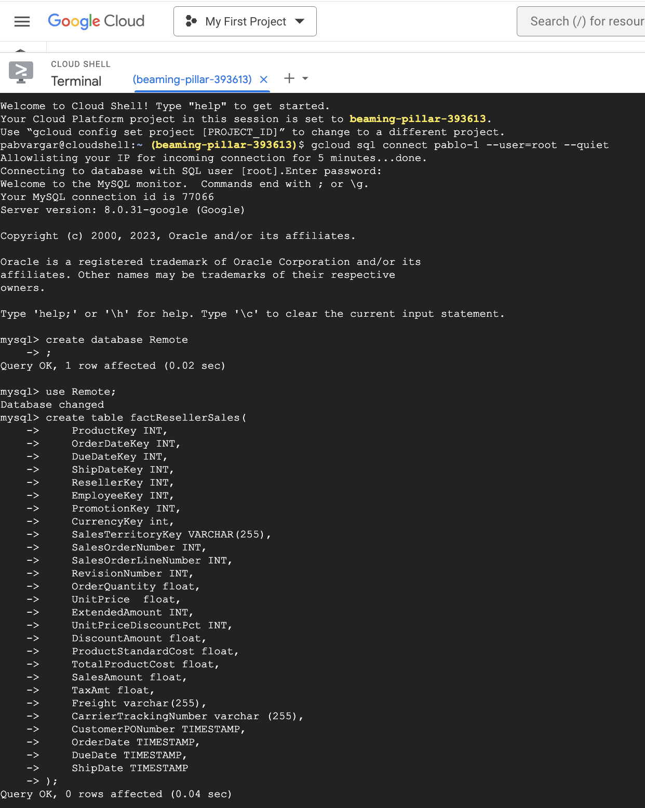
    - Check the new Remote database is created in the MySQL instance
    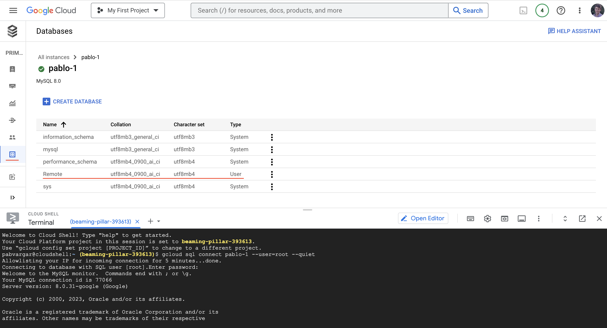
6. Load tables:
    - Download each tab of the assigment google sheet in .csv in your local machine
    - Go to Google Storage 
    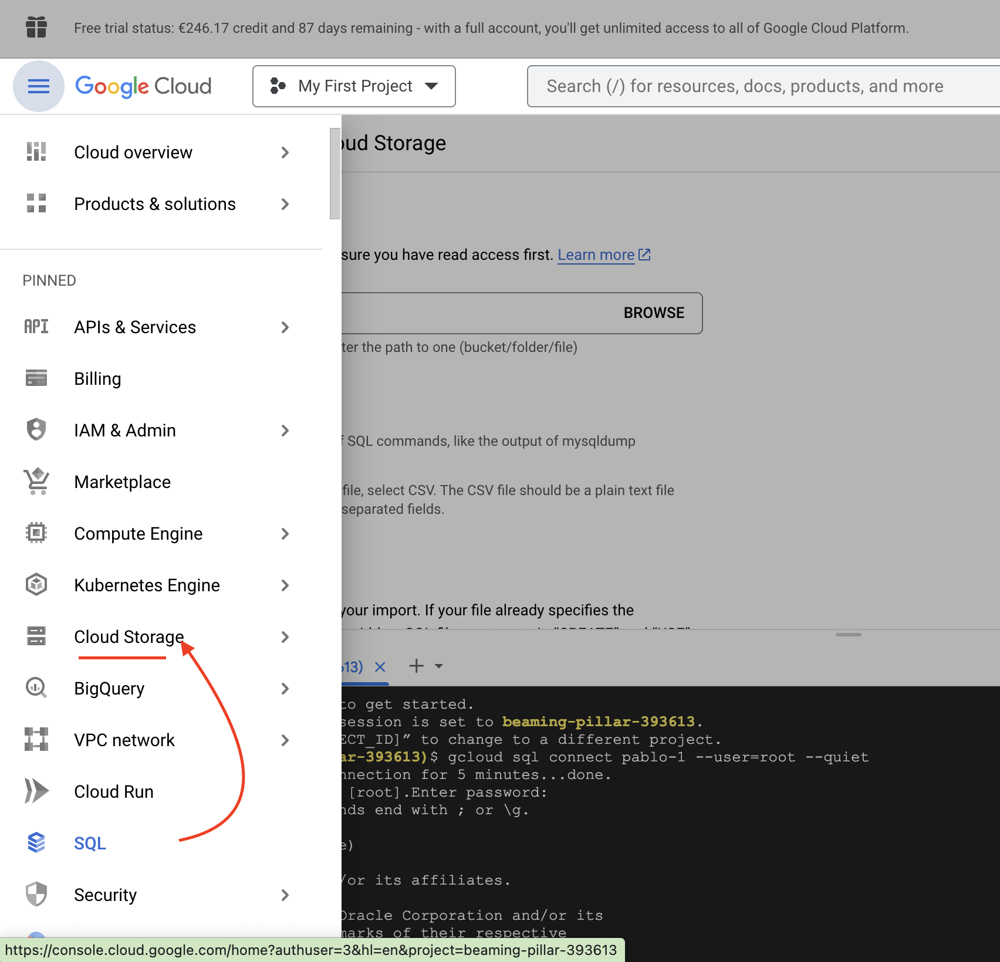
    - Upload the .csv files to [Google Storage Buckets]( https://cloud.google.com/storage/docs/uploading-objects)
    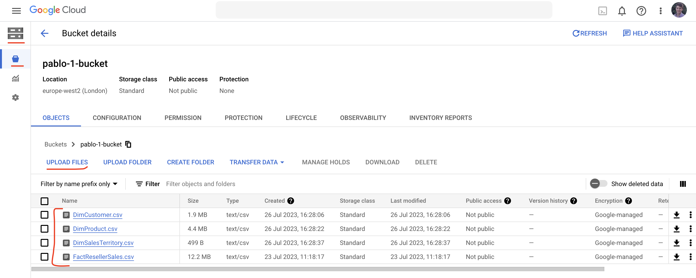
    - Go back to to Google SQL>Overview page>Insert
    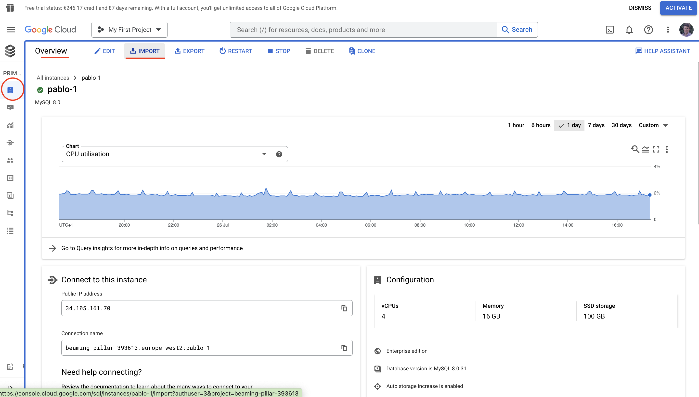
    - Import the each csv into the correct table inside Remote database (example below FactResellerSales) 
    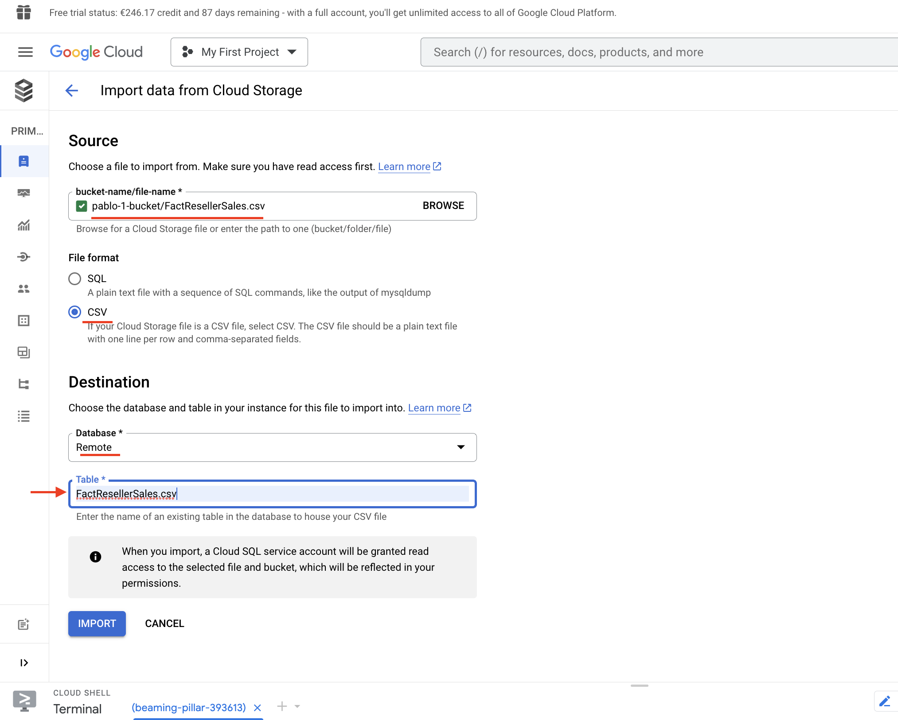
7. Connect Google BigQuery to Google Cloud SQL [(guide)](https://cloud.google.com/bigquery/docs/connect-to-sql)
    - Go to [IAM](https://cloud.google.com/sql/docs/mysql/users) (Information Access Management) 
    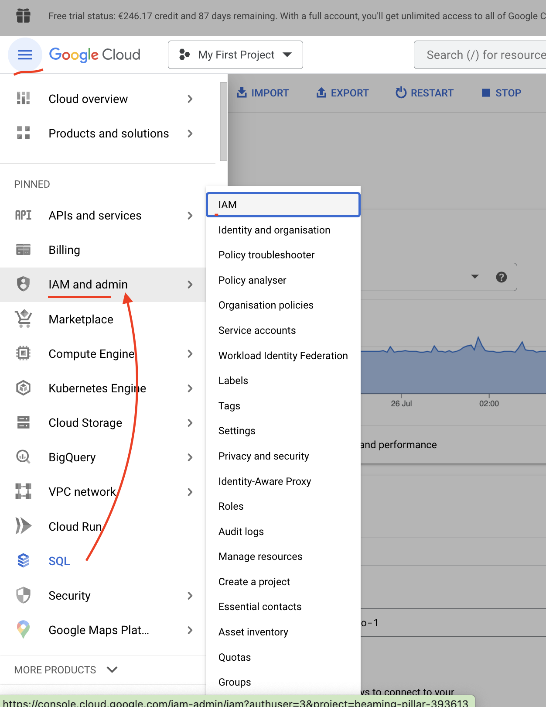
    - Grant your user Cloud SQL admin and user rights
    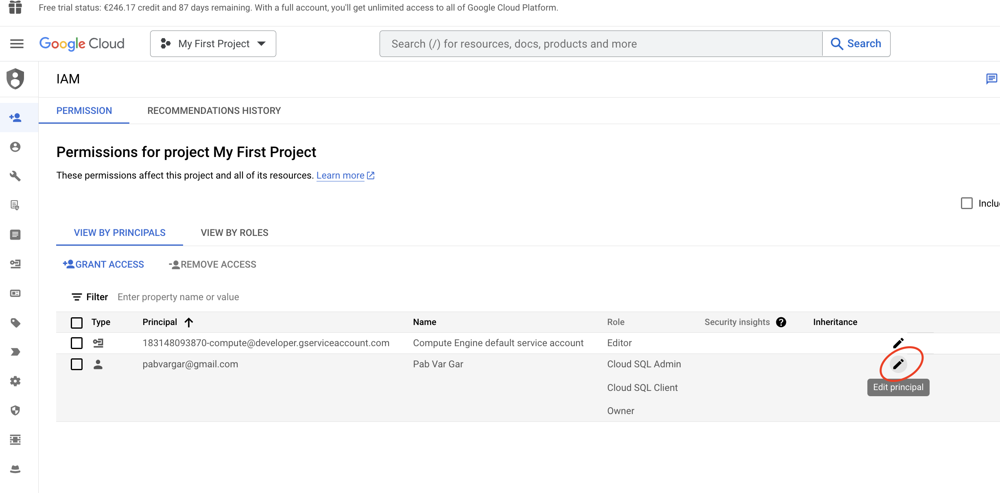
    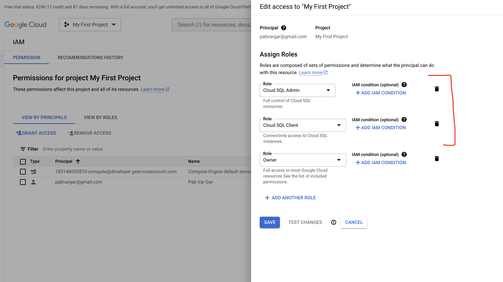
    -  Go to BigQuery 
    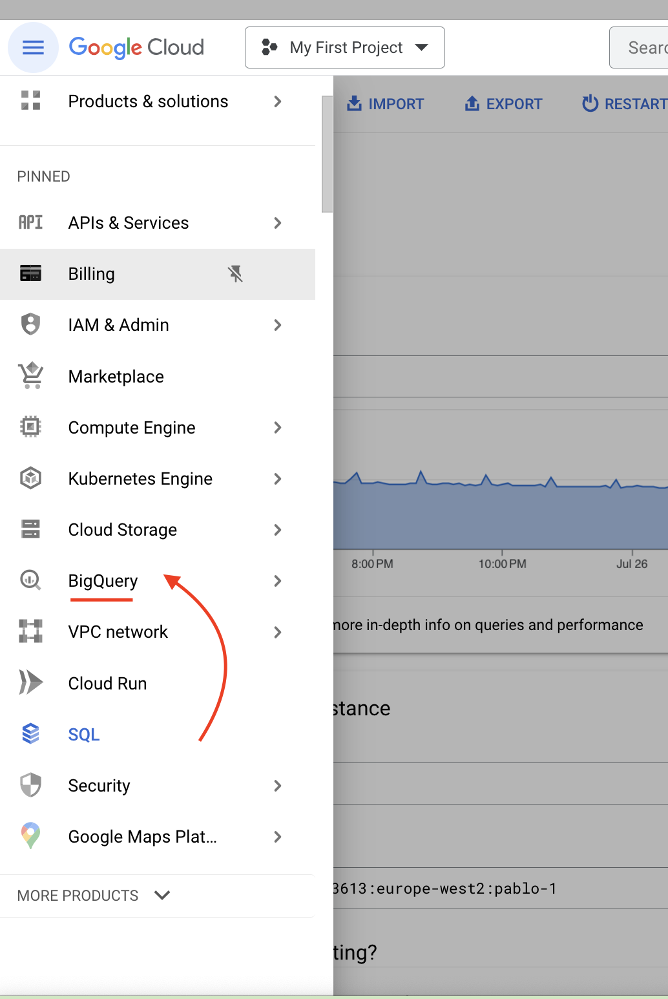
    - Click on Add>Connections to external data sources
    
    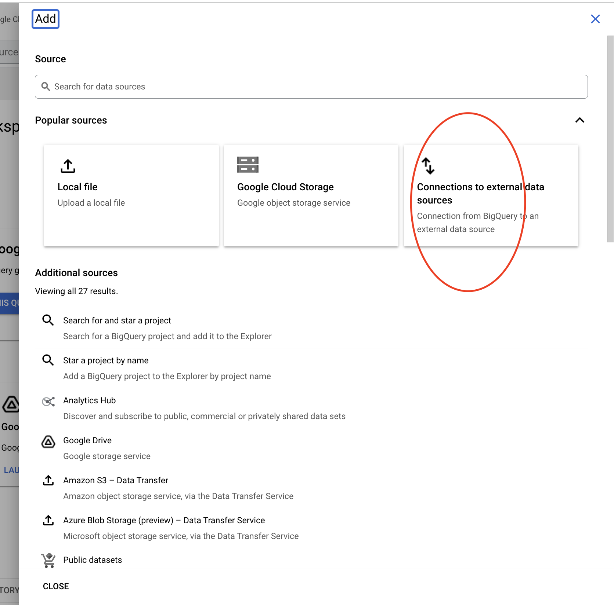
    - Configure the external data source connection as shown below:
    
    - Now you can start querying the tables!
    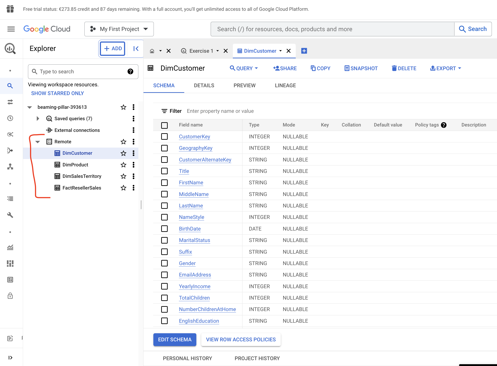

<br/>

_Note_: this was my first time using Google Cloud Platform. After doing the database set up in GCP SQL, I discovered an easier way to set up database directly in Google BigQuery just by importing the .csv


## PART 2 - EXPLORATORY ANALYSIS

I start the database exploration by having a general look at the schema, the columns contained in each table and relationships between tables.

The schema of this assignment consist of 4 tables, 3 dimensional tables with Product, SalesTerritory and Customer data and a Fact table with sales data.


From this first exploration I noticed some ***data quality issues***: 
1. Uncompleted schema:
    - FactResellerSales does not include CustomerKey. This means that there is an isolated dimensional table (DimCustomer), which cannot join with the fact table. 
    - DimCustomer includes a key (GeographyKey) which is not related to any table, including the dimensional table containing geography data (DimSalesTerritory). The schema should include a DimGeography table to be complete.
    - FactResellerSales contains a series of keys (ResellerKey, EmployeeKey, PromotionKey and CurrencyKey) unrelated to any dimensional table. The schema should include a DimReseller, DimEmployer, DimPromotion and DimCurrency tables to be complete.
    - DimProduct includes a key ProductSubcategoryKey which is not related to any table. The schema should include a DimProductSubcategory table to be complete.
2. Data Accuracy issue: 
    - DimSalesTerritory contains a row full of 'NA' (SalesTerritoryKey=11). 
3. Potential bad case practise: 
    - DimSalesTerritory alternate key values are the same as the primary key except for SalesTerritoryKey=11. Normally, an alternate key should contain unique values that identify each row and could be an alternative to the primary. In this case, alternate key values are "correct" but its parallel with the primary key seems a bad practise.

<br/>

After the above general observations, I start using SQL to run a series of general checks: 
1. Primary/Alternate key duplications: the purpose is to verify that those key are unique in the dimensional tables.
2. Referential integrity: the purpose is to verify that relationships between tables are valid and consistent. The fact table should be able to join with the dimensional tables without losing any rows.
3. Validate date columns: the purpose is to check date ranges, future/past dates, or illogical date/time combinations.
4. Validate numerical columns: the purpose is to verify there is no unexpected values (i.e. a negative value in SalesAmount, illogical max/min values) or statistical outliers in the columns with numerical data.

<br/>

**Data quality issues** found using SQL:
1. AlternateKey duplications in DimProduct:
    - DimProduct contains duplicated ProductAlternateKey, which should be unique per Product. The count(distinct) of the ProductAlternateKey should be equal to rownumber, but it isn't as shown in the below query:
    ```
    SELECT  COUNT(*), 
            COUNT (distinct ProductKey) AS Counter1,
            COUNT (distinct ProductAlternateKey) AS Counter2
    FROM Remote.DimProduct
    ```
    - The below query shows the rows having a Product with duplicated AlternateKey (ProductKey has more than 1 ProductAlternateKey)
    ```
    SELECT *
    FROM Remote.DimProduct
    WHERE ProductAlternateKey IN (
            SELECT ProductAlternateKey
            FROM (
                    SELECT  ProductAlternateKey,
                            COUNT (ProductAlternateKey) AS Counter2
                    FROM Remote.DimProduct
                    GROUP BY ProductAlternateKey
                    HAVING counter2>1
            )
    )
    ORDER BY ProductAlternateKey
    ```
    - Scope of the issue: 25% (142) of the ProductKey has more than one ProductAlternateKey
2. Referential integrity between FactResellerSales and DimProduct
    - FactResellerSales loses rows when joined with DimProduct. This means that some ProductKey are missing in DimProduct. The below query shows the list of ProductKey contained in the fact table but missing in the dimensional table.
    ```
    WITH tab1 AS(
        SELECT ft.ProductKey AS P1
        FROM  Remote.FactResellerSales ft
        JOIN Remote.DimProduct dp ON (ft.ProductKey = dp.ProductKey)
        group by P1
        ), tab2 AS(
            SELECT ProductKey AS P2
            FROM  Remote.FactResellerSales
            GROUP BY P2
        )
    SELECT tab2.P2
    FROM tab2
    WHERE tab2.P2 NOT IN (SELECT p1 from tab1)
    GROUP BY P2
    ```
    - Scope of the issue: 10% (6073) rows are lost FactResellerSales and 33 ProductKey missing in DimProduct (5% of Total). Query to measure the number of rows lost:
    ```
    WITH tab1 AS (
        SELECT count(*) JoinedRows
        FROM  Remote.FactResellerSales ft
        JOIN Remote.DimProduct dp ON (ft.ProductKey = dp.ProductKey)
    ), tab2 AS(
        SELECT count(*) FactRows
        FROM  Remote.FactResellerSales
    )
    SELECT  tab1.JoinedRows,
            tab2.FactRows,
            (tab2.factRows-tab1.joinedRows) LostRows
    FROM tab1,tab2
    ```
3. Invalid date in DimProduct: 
    - DimProduct StarDate contains values that are not timestamp (i.e 00:00.0). This forced to set up the column as VARCHAR type instead of TIMESTAMP when creating the database. The below query shows those cases:
    ```
    SELECT  ProductKey,
            StartDate
    FROM    Remote.DimProduct
    WHERE StartDate = '00:00.0'
    ``` 
    - Scope of the issue: 26% (151) of the StarDate are set as '00:00.0'
4. NULL date in DimProduct: 
    - DimProduct has NULL StartDate and EndDate. The below query show the Products in this situation
    ```
    SELECT  ProductKey
    FROM    Remote.DimProduct
    WHERE   (StartDate IS NULL) 
            or (EndDate IS NULL)
    ```
    - Scope of the issue: 23% (132) of the Product are in this situation
5. Critical NULLs in DimProduct: 
    - ProductSubcategoryKey contains NULL values. The below query shows the Products in this situation
    ```
    SELECT  ProductKey,
            ProductSubcategoryKey
    FROM    Remote.DimProduct
    WHERE ProductSubcategoryKey IS NULL
    ```
    - Scope of the issue: 94% of the ProductSubcategoryKey values are null
6. Unexpected Currency in FactResellerSales
    - FactResellerSales transactions in France (SalesTerritoryKey=7) has been done in two difference CurrencyKey. This is a potential data quality issue (except business rules specifies french transactions can be in € and $). The below query shows that France has transactions in two CurrencyKey (36 and 100)
    ```
    SELECT  SalesTerritoryKey,
            CurrencyKey
    FROM    Remote.FactResellerSales
    WHERE   SalesTerritoryKey  = (  
                SELECT  SalesTerritoryKey
                FROM Remote.FactResellerSales
                GROUP BY SalesTerritoryKey
                HAVING COUNT(DISTINCT CurrencyKey)>1
            )
    GROUP BY SalesTerritoryKey, CurrencyKey
    ```
7. Contradicting Children Data in DimCustomer
    - DimCustomer has two columns with children data containing contradicting values for certain customers. The query below shows the customers whose number of NumberChildrenAtHome are bigger than the TotalChildren:
    ```
    SELECT  Customerkey,
            TotalChildren,
            NumberChildrenAtHome
    FROM Remote.DimCustomer
    WHERE TotalChildren < NumberChildrenAtHome
    ```
     - Scope of the issue: 7% (1431) of the customer


<br>

**Note**: data quality could have been analysed further if there was more context provided, i.e.:
1. Business rules: which normally contrains data, allowing to check illogical combinations or critical NULLs.
2. Have a sample of expected data to verify against.


## PART 3 - SQL QUESTIONS 
### EXERCISE 1
Query solution:
```
WITH 
  TempTab AS (
    SELECT  ft.OrderDate,
            ft.SalesAmount,
            RANK() OVER (PARTITION BY FORMAT_TIMESTAMP('%Y%m', ft.OrderDate) ORDER BY ft.SalesAmount DESC) AS rank
    FROM  Remote.FactResellerSales ft
    JOIN Remote.DimProduct dp ON (ft.ProductKey = dp.ProductKey)
    WHERE FORMAT_TIMESTAMP('%Y', ft.OrderDate) = '2012'
          AND dp.ProductName = "Sport-100 Helmet, Red"
  )
SELECT  FORMAT_TIMESTAMP('%m-%Y', OrderDate) AS Month,
        SalesAmount,
        FORMAT_TIMESTAMP('%Y-%m-%d', OrderDate) AS OrderDate
FROM  TempTab
WHERE rank=1
ORDER BY Month
```
Context before query explanation: 
1. The product "Sport-100 Helmet, Red" belong to the data quality issue explained in the prior section (it has 3 different ProductKeys in DimProduct). However, this is not going to affect the analysis. Due to there is only one ProductKey value per month during 2012, (Pk=123 Jan-Nov ; Pk=214 Dec)
2. Combining all keys (ProductKey, OrderDateKey, DueDateKey, ShipDateKey, ResezllzerKey, EmployeeKey, PromotionKey, CurrencyKey, SalesTerritoryKey) per row in the fact table, I deduce that all rows are unique transactions. This means that no sum(SalesAmount) is needed in this analysis. 
3. DimProduct and FactResellerSales can be connected using ProductKey

Query explanation:
1. The solution includes a temporay table - WITH (...) - and the main query. 
2. Temporary table: it ranks the transactions per month. For this purpose, I use rank() which partitions the fact table by month and rank rows based on SalesAmount. The transaction with the highest SalesAmount per month will have a rank of 1. Moreover, the WHERE clause limit this table to the desired year and product. To get the ProductName, I join the fact and DimProduct using the common key (ProductKey).
3. The main query retrieves from the temporary table the highest transactions for each month (rank=1). It also formats the dates as specified in the assigment.


Result observation: all biggest sales happened the last few days of each month. 

### EXERCISE 2
Query solution:
```
SELECT  dp.ProductName,
        sum(ft.SalesAmount) AS SalesAmount,
        FORMAT_TIMESTAMP('%m-%Y',ft.OrderDate) AS Month
FROM  Remote.FactResellerSales ft
      JOIN Remote.DimProduct dp ON (ft.ProductKey = dp.ProductKey)
WHERE FORMAT_TIMESTAMP('%Y', ft.OrderDate) = '2012'
GROUP BY dp.ProductName, Month
```
Context before query explanation: 
1. As a result of the database referential integrity issues, there are 33 ProductKey included in FactResellerSales but missing DimProduct. Those products are excluded from this analysis.

Query explanation:
1. The total sales is calculated using sum() combined with GROUP BY per product and month 
2. Fact and dimensional table are joined using ProductKey. This inner join ensures that product without any sales in 2012 are excluded. Also, the join allows to retrieve ProductName from the dimensional table. 

### EXERCISE 3
Query solution:
```
WITH TempTab AS 
  (
    SELECT  CustomerKey,
            CASE WHEN DATE_DIFF(CURRENT_DATE(), BirthDate, YEAR) < 35 THEN 1 ELSE 0 END AS AgeBelow35,
            CASE WHEN DATE_DIFF(CURRENT_DATE(), BirthDate, YEAR) BETWEEN 35 AND 50 THEN 1 ELSE 0 END AS AgeBetween35and50,
            CASE WHEN DATE_DIFF(CURRENT_DATE(), BirthDate, YEAR) > 50 THEN 1 ELSE 0 END AS AgeAbove50
    FROM Remote.DimCustomer
)
SELECT  dc.MaritalStatus,
        dc.Gender,
        SUM(tab.AgeBelow35) AS AgeBelow35,
        SUM(tab.AgeBetween35and50) AS AgeBetween35and50,
        SUM(tab.AgeAbove50) AS AgeAbove50
FROM TempTab tab
JOIN Remote.DimCustomer dc ON (tab.CustomerKey = dc.CustomerKey)
GROUP BY dc.MaritalStatus, dc.Gender
```
Query explanation:
1. The solution includes a temporay table - WITH (...) - and the main query.
2. Temporary table: it classifyies each customer per age range. For this purpose, it creates three columns (AgeBelow35, AgeBetween35and50 and AgeAbove50) using CASE(). Each CASE contains a binary indicator (1 or 0) depending on Age. Age is calculated as the difference between current_Date and BirthDate. Each customer has only one of those columns set as 1, the rest as 0.
3. Main query: by sum() the indicators created in TempTab , it shows the number of customers per age group for each unique combination of MaritalStatus and Gender. To 

Result observation: Married Men are the biggest group in all age buckets

### EXERCISE 4
Query solution:
```
WITH 
  TempTab1 AS (
    SELECT  ProductKey,
            SalesTerritoryKey,
            FORMAT_TIMESTAMP('%m-%Y', OrderDate) AS Month,
            sum(SalesAmount) AS SalesAmount
    FROM  Remote.FactResellerSales
    WHERE FORMAT_TIMESTAMP('%Y', OrderDate) = '2012'
    GROUP BY ProductKey, SalesTerritoryKey, Month
  ),
  TempTab2 AS (
    SELECT  ProductKey,
            SalesTerritoryKey,
            Month,
            SalesAmount,
            RANK() OVER (PARTITION BY Month ORDER BY SalesAmount) AS rank
    FROM  TempTab1
  )
SELECT  Month,
        ds.SalesTerritoryCountry,      
        dc.ProductName,
        SalesAmount
FROM TempTab2 tt
JOIN Remote.DimProduct dc ON (tt.ProductKey = dc.ProductKey)
JOIN Remote.DimSalesTerritory ds ON (tt.SalesTerritoryKey = ds.SalesTerritoryKey)
WHERE rank=1
ORDER BY Month
```
Query explanation:
1. The solution includes two temporay tables - WITH (...) - and the main query.
2. Temporary table 1 (TempTab1): it calculates the monthly total sales per Product and Territory
3. Temporary table 2 (TempTab2): it ranks TempTab1 results, obtaining the rank of the Product & Territory total sales per month. For this purpose, I use rank(), which partitions TempTab1 by month and ranks rows based on SalesAmount. The Product & Territory with the highest total sales per month will have a rank of 1
4. Main query: it retrieves from TempTab2 the highest transactions for each month (rank=1). It also gets the ProductName and SalesTerritoryCountry by joining TempTab2 with the dimensional tables.

<br>
Result notes: for some months, there are 2 combinations of Product & Country with the lowest sales amount.
